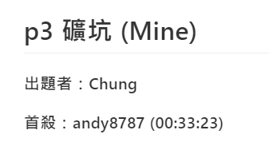

https://apcs-simulation.com/contest/4/rank

255 四級分

已經多少次模擬四級分了.....

pA 55分 水題還會錯....，總之有個小細節沒有看到吧.....

pB 100分 題目敘述很...，但看懂後簡簡單單了，題目真的很難懂，害我浪費一小時半吧QQ

pC 比pB還簡單，沒什麼好說的XD

pD 應該是背包問題，但沒時間了QQ

題解
https://hackmd.io/@NNkVZZUATmWDTvr4T_hfPg/rJT0BcS10

居然pC首殺wwww
